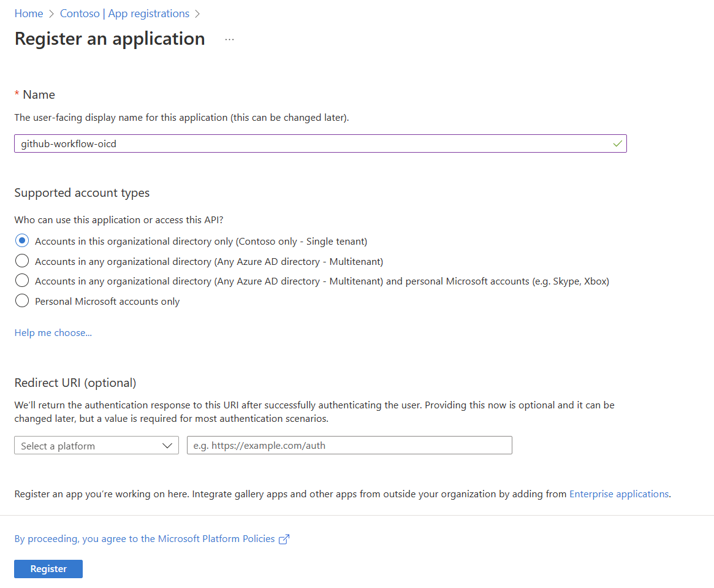
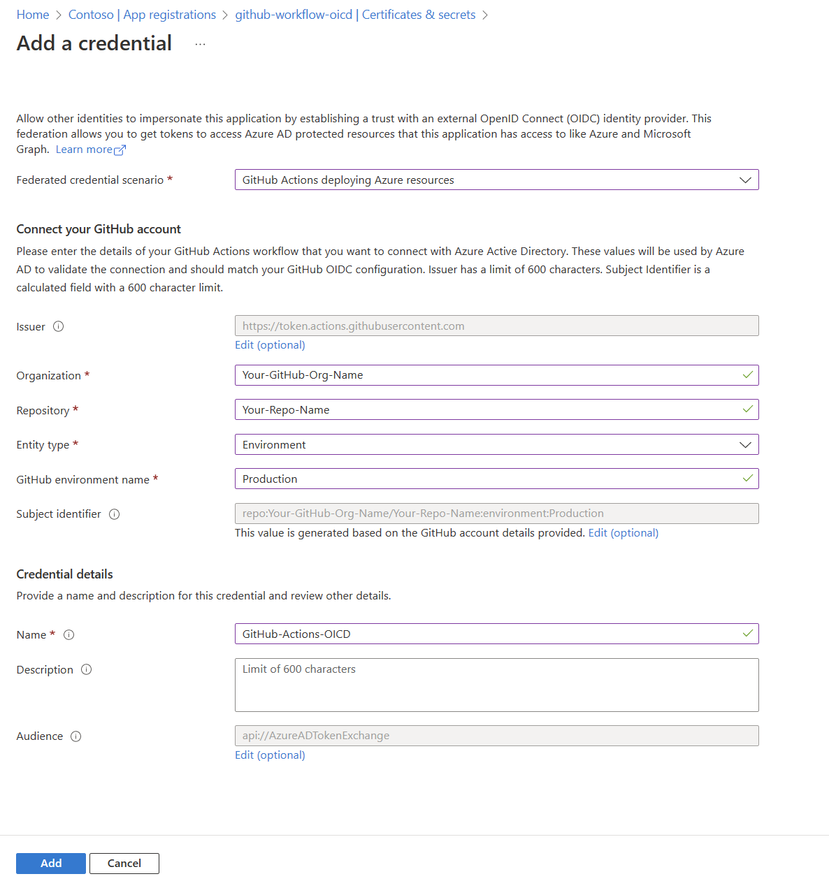
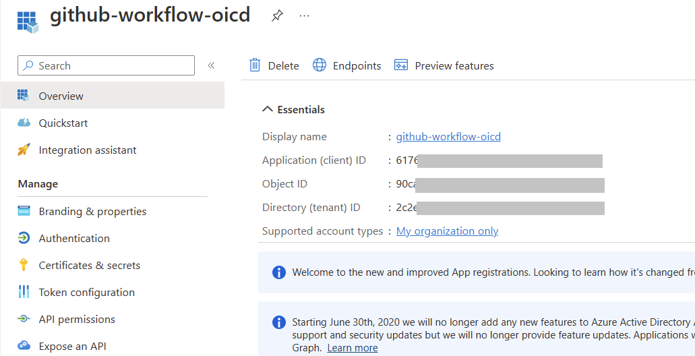
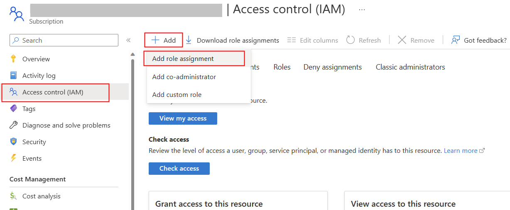
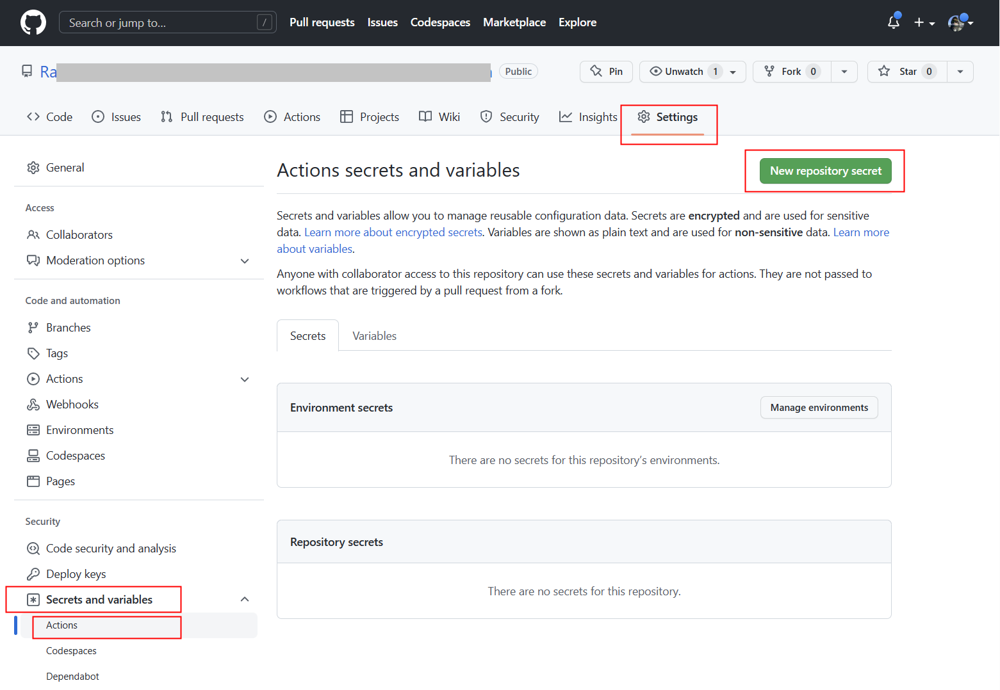
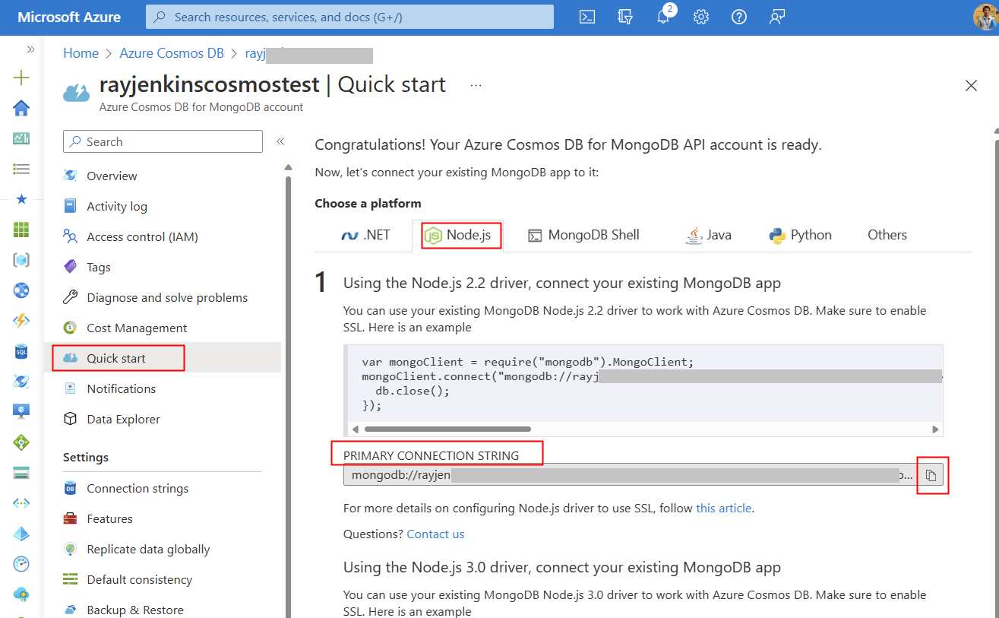
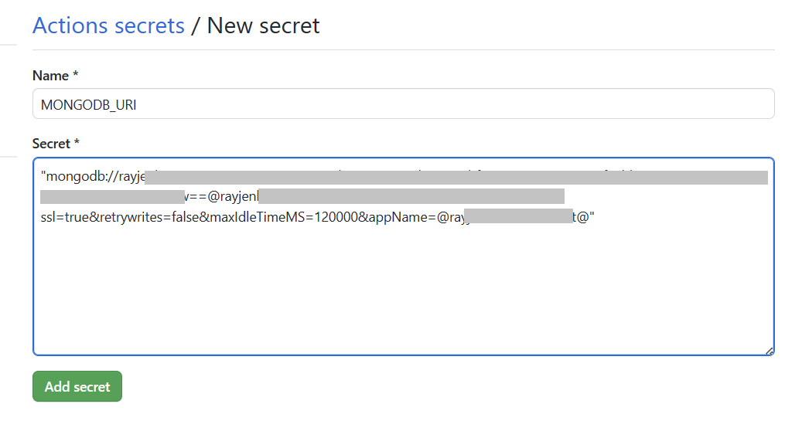
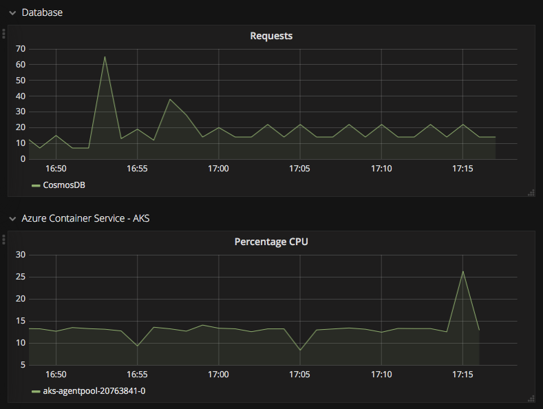

# Container CI/CD using GitHub Actions and Kubernetes on Azure Container Service (AKS)

## Architecture overview

Containers make it very easy for you to continuously build and deploy your applications. By orchestrating deployment of those containers using Kubernetes in Azure Container Service, you can achieve replicable, manageable clusters of containers.

By setting up a continuous build to produce your container images and orchestration, you can increase the speed and reliability of your deployment.


1. Change application source code.
2. Commit code to GitHub.
3. Continuous Integration Trigger to GitHub Actions.
4. GitHub Actions workflow triggers a build job using Azure Container Service (AKS) for a dynamic build agent.
5. GitHub Actions builds and pushes Docker container Azure Container Registry.
6. GitHub Actions deploys new containerized app to Kubernetes on Azure Container Service (AKS) backed by Azure Cosmos DB.
7. Grafana displays visualization of infrastructure and application metrics via Azure Monitor.
8. Monitor application and make improvements.

## Create Azure Environment

1. Create ACR - Azure Container Registry

   > Note:
   >
   > `ACR` (Azure Container Registry) names may contain alpha numeric characters only. A valid name is `acr1801301512`.

2. Create AKS - Azure Kubernetes Cluster

   > Note:
   >
   > `Dns prefix` must be unique, consider using `<service-name>-<appid>`, such as `GitHub Actions-902d2aea-74dd-4f80-a0a6-7f6a976bb9b7` or at least part of it.

3. Create a Cosmos DB with Mongo DB API

   > Note:
   >
   > The names and DNS prefixes should be unique. To avoid naming conflicting, we strongly recommend you to add some suffix. For example, the `Cosmos Db name` could be `cosmos-180130-1512`.

## GitHub Actions Workflow

### Create an Azure AD OIDC for GitHub Actions

1. On Azure AD - App Registration, create a new app for GitHub Actions

   

2. Once the new app registered, go to **Certificates & secrets** and create a new credential:

   

3. Grant permissions to your GitHub org and repo:

   

4. Go to the Overview page of your Azure AD App, you will use the Application (client) ID to update your workflow:

   

5. Add a Contributor role to your Azure Subscription:

   

6. Add Mongo DB connection string as a secret:

   

7. Copy the primary connection string from your Cosmos DB to GitHub Actions secret:

   

   

## Access the hello world web app

### Sign into Azure and get AKS credentials

1. Open terminal, execute:

   ```sh
   az login
   ```

   Follow the guide to sign in.

2. Execute the command below to get Kubenetes cluster credentials.

   ```sh
   aks get-credentials --resource-group <ResourceGroup> --name <KubenetesClusterName>
   ```

   > Note: please replace \<ResourceGroup> and \<KubenetesClusterName> before executing it.

   When done, you will get a prompt:

   ```Sh
   Merged "kube-180131-1520" as current context in /Users/<User>/.kube/config
   ```

### Get Kubenetes service

1. Install [kubectl](https://kubernetes.io/docs/tasks/tools/install-kubectl/) if you have not. Or, you can install `kubectl` locally using the [az aks install-cli](https://docs.microsoft.com/en-us/cli/azure/aks#az-aks-install-cli) command:

   ```sh
   az aks install-cli
   ```

2. Execute the command below:

   ```Sh
   kubectl get service
   ```

3. You will get the response like below:

   ```Sh
   NAME                  TYPE           CLUSTER-IP   EXTERNAL-IP      PORT(S)        AGE
   hello-world-service   LoadBalancer   10.0.98.99   52.168.126.156   80:32611/TCP   1h
   kubernetes            ClusterIP      10.0.0.1     <none>           443/TCP        1h
   ```

4. Copy the **external ip** of the **hello-world-service**.

### Access from browser

1. Open the **external ip** in a browser. You will see the response:

   ```html
   Hello World!
   There are 0 request records.
   ```

2. Refresh the page, the number of request records will increase.

## Create Grafana Monitor

1. Install [Azure CLI](https://docs.microsoft.com/en-us/cli/azure/install-azure-cli?view=azure-cli-latest) if you have not.

   > Note: Alternatively, you can also use Azure Cloud Shell from the Azure Portal.

2. Open terminal, then execute:

   ```sh
   az login
   ```

   Follow the guide to sign in.

   > Note: If you use Azure Cloud Shell from the Azure Portal, you are automatically authenticated. Therefore there is no need to ``az login`` again.

3. Execute the command below to create service principal, with the role ``Contributor`` and under the current subscription by default.

   ```sh
   az ad sp create-for-rbac --name <AppName> --role Contributor --scopes /subscriptions/{subscriptionId}
   ```

   > Note: please replate the \<AppName> placeholder.

4. You will get a response like below.

   ```json
   {
      "appId": "8e897eb4-069d-40c2-9563-000000003c14",
      "displayName": "<AppName>",
      "password": "xxxxxvJgeKZoRAfxxxx0SitnANH8Kxxxx",
      "tenant": "000088bf-0000-0000-0000-2d7cd0100000"
   }
   ```

   Copy the values **appId** and **password**, they will be used later.

   > Note: for more details about creating an Azure service principal, please refer to [Create an Azure service principal with Azure CLI 2.0](https://docs.microsoft.com/en-us/cli/azure/create-an-azure-service-principal-azure-cli?view=azure-cli-latest)

5. Create an Azure VM with Ubuntu OS

6. Follow this doc to install Grafana on your Azure VM: https://grafana.com/docs/grafana/latest/setup-grafana/installation/debian/

### Access the Grafana instance

1. Copy the GRAFANAURL value from the Outputs section of the deployment.

2. Open it in a browser, then log in:

   * User: admin
   * Password: *use the Linux Admin Password*

3. Click **Home**.

   

   Then click **Hello World Overview**:

   

4. You will see the graphs:

   

5. If you want to SSH to Grafana host machine, you can open terminal, then paste and execute a command like below.

   ```Sh
   ssh -i <private_ssh_key>  <username>@<GRAFANAURL>
   ```

## References

* [Configure a federated identity credential on an app - GitHub Actions](https://learn.microsoft.com/en-us/azure/active-directory/develop/workload-identity-federation-create-trust?pivots=identity-wif-apps-methods-azp#github-actions)

* [GitHub Actions Billing](https://docs.github.com/en/billing)

* [GitHub Actions - Azure Login](https://github.com/marketplace/actions/azure-login#configure-a-federated-credential-to-use-oidc-based-authentication)

* [GitHub Actions - Assigning permissions to jobs](https://docs.github.com/en/actions/using-jobs/assigning-permissions-to-jobs)

* [GitHub Actions - Azure Container Registry Login](https://github.com/marketplace/actions/azure-container-registry-login)

* [GitHub Action - Azure Container Registry Build](https://github.com/marketplace/actions/azure-container-registry-build)

* [GitHub Actions for deploying to Kubernetes service](https://learn.microsoft.com/en-us/azure/aks/kubernetes-action)

* [GitHub Action - envsubst-action](https://github.com/marketplace/actions/envsubst-action)
