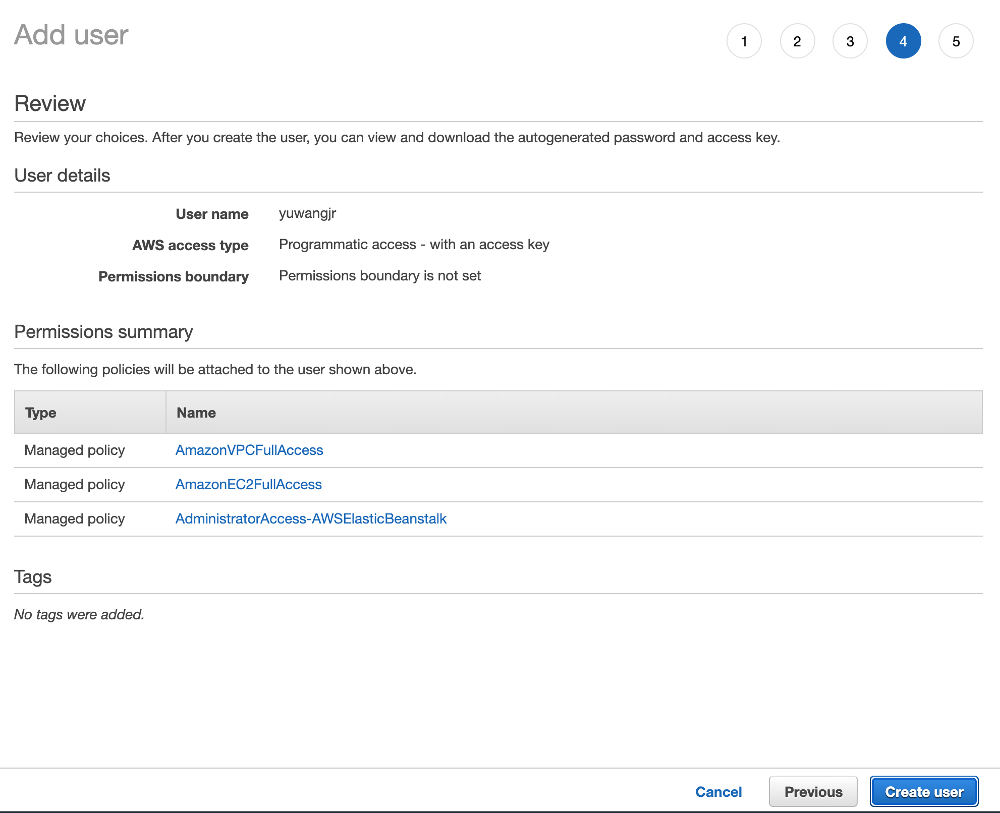
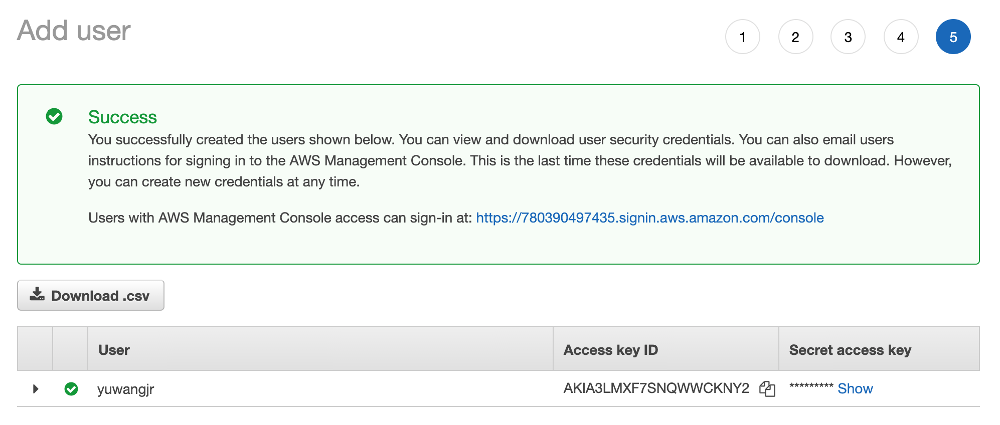
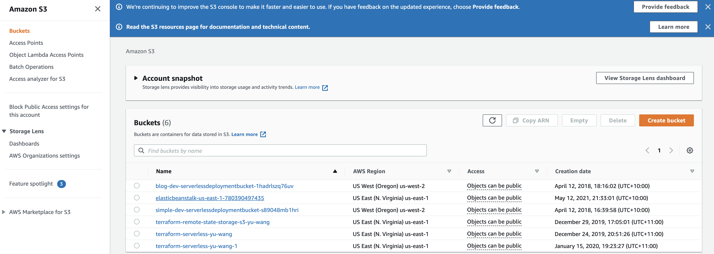

# Github Action CI/CD

### Goal: Build, Test and Deploy a web-app to AWS Elastic Beanstalk from scratch
ref: https://medium.com/paul-zhao-projects/building-a-ci-cd-pipeline-with-travis-ci-docker-and-aws-in-9-steps-4f51f5be921a

## What is CI/ CD?


### Continuous Integration
Successful **Continuous Integration** means code changes to a web-app are regularly built, tested, and merged to a shared
repository automatically via integration tools like TravisCI, Bitbucket pipeline.
It’s a solution to the problem of
1. having too many developers writing code changes to a web-app that might conflict with each other.
2. code testing and validation before merging.

### Continuous delivery
Continuous delivery usually means a developer’s changes to an application are automatically bug tested and
uploaded to a repository (like GitHub or a container registry), where they can then be deployed to a live
production environment by the operations team.
It’s an answer to the problem of poor visibility and communication between dev and business teams.
To that end, the purpose of continuous delivery is to ensure that it takes minimal effort to deploy new code.

### Continuous deployment
Continuous deployment (the other possible “CD”) can refer to automatically releasing a developer’s changes from
the repository to production, where it is usable by customers. It addresses the problem of overloading operations
teams with manual processes that slow down app delivery. It builds on the benefits of continuous delivery by
automating the next stage in the pipeline.


# Hands-on

## At the end of this hands-on
* You will experience a step-by-step guidance for CD and will be able to set up a simple CD via Travis pipeline
  and deploy a react app on AWS (Note this tutorial is simply for illustration purpose; do not use in production)


## Prerequisite
* Installed Docker
* Installed Npm

# i) Hands-on CI

## 1.Create and Run a web-app
Create a sample web-app skeleton with npx
```
$ npx create-react-app my-app
npx: installed 98 in 6.337s

Creating a new React app in /Users/paulzhao/my-app.

Installing packages. This might take a couple of minutes.
Installing react, react-dom, and react-scripts with cra-template...

.
.
.
```

Run the web-app
```
$ cd my-app
$ npm start
```

You should see but on localhost:3000:


(Optional) If you had this error:
```
You are running `create-react-app` 4.0.3, which is behind the latest release (5.0.0).
```
Follow this guide to fix it: https://stackoverflow.com/questions/70358643/you-are-running-create-react-app-4-0-3-which-is-behind-the-latest-release-5-0


## 2.Dockerise your web-app
Add Two files to my-app folder
Dockerfile — Used for building the image that contains the optimized version of this application
```
FROM node:16 AS builder
# Above, we set the base image for this first stage as a light weigh node

WORKDIR './app'
# Above we set the build environment as a folder called /app in the docker container to prevent clashes

COPY package*.json ./
# To prevent repeated npm installs anytime we make any change, we'd copy over the package.json and install things first

RUN npm install
# Install dependencies

COPY ./ ./
# Copy the rest of the project over to the /app folder in the container

RUN npm run build
# Build the production version of our app in the container

FROM nginx
# The image needs nginx to run on aws

EXPOSE 80
#Nginx runs on port 80, so elastic beanstalk uses the expose command to expose this port

COPY --from=builder /app/build /usr/share/nginx/html
# Copy the content of the builder step, move the contents of build folder into the html folder in this nginx container
# That's where our app would run from in aws

# No need to specify a command to start nginx as it gets started by default when a container with the image starts
```
Dockerfile.dev — Used for building the image that contains the development version which would be used to run tests

```
FROM node:16
# Above, we set the base image as a light weight node image called alpine

WORKDIR '/app'
# Above we set the build environment as a folder called /app in the docker container to prevent clashes

COPY package.json .
# To prevent repeated npm installs anytime we make any change, we'd copy over the package.json and install things first

RUN npm i

COPY . .
# Copy the rest of the project over to the /app folder in the container

CMD ["npm", "start"]
# Here we are setting the default command when a container is built and started up from this our image
```

Your folder structure should now looks like this (without .travis.yml file):


(Optional) You can run locally the docker containers
```
docker build -t my-app .
docker run --rm -p 80:80 --name react-app my-app
```
or
```
docker build -t my-app-dev -f Dockerfile.dev .
docker run --rm -p 3000:3000 --name react-app-dev my-app-dev
```

(Optional) Further reading: https://dev.to/xr0master/why-is-npm-start-bad-for-production-1hmk

## 3. Add the repo to Github
Create a repo in your github


Follow the steps in the second section to push existing repo from the command line


(Optional) Of course, if you are interested, try to run the docker commands above yourself


(Optional) Of course, you can also run docker locally by
```
# Build an image with the tag sample app; this command will search for Dockerfile in your local folder
docker build -t sample-app . 

# Run the app at port 80
docker run -p 80:80 sample-app 

# now you should be able to access the react UI via localhost
```

## 4. Let us setup Github Action CI

create a new YAML file named `ci.yml` or something similar in the `.github/workflows` directory in your repository. 
Copy and paste the example workflow code into the file and commit it to your repository. 
Whenever you submit a pull request, the workflow will run automatically and perform the specified tests.
```
name: Node.js CI

on:
  push:
    branches:
      - main

jobs:
  build:
    runs-on: ubuntu-latest

    steps:
    - name: Checkout code
      uses: actions/checkout@v2

    - name: Setup Node.js
      uses: actions/setup-node@v2
      with:
        node-version: 16

    - name: Build Docker image
      run: docker build -t yuwangjr/sample-app -f Dockerfile.dev .

    - name: Run tests
      run: docker run -e CI=true yuwangjr/sample-app npm run test -- --coverage --watchAll=false

```
This GitHub Actions workflow sets up a Node.js environment, builds a Docker image, and runs tests using the image.

The workflow uses the on field to specify when the workflow should run: whenever there is a push or pull request to the main branch.

The jobs section specifies a single job named build, which runs on the ubuntu-latest environment. The job consists of four steps:

* Checking out the code from the repository
* Setting up Node.js on the environment
* Building a Docker image using the Dockerfile.dev file
* Running tests in a Docker container using the built image

Note that the uses field in the Setup Node.js step specifies the actions/setup-node action to set up the Node.js environment. 
This action automatically installs the specified version of Node.js and sets up the environment variables.

Now push the changes to your git repo
```
git checkout -b "feature/introduce_ci"
git add .
git commit -m "Introduce github action CI pipeline"
git push --set-upstream origin "feature/introduce_ci"
git checkout main
```
click the link to create the pull request and see what happens

Question: Can you add steps to push the test passed image to dockerhub?

# ii) Hands-on CD

## 1. Create AWS Elastic Beanstalk
AWS Elastic Beanstalk is an easy-to-use service for deploying and scaling web applications and services developed with
Java,. NET, PHP, Node. js, Python, Ruby, Go, and Docker on familiar servers such as Apache, Nginx, Passenger, and IIS.

Now let us configure AWS manually via AWS UI to help you understand what needs to be done as a bare minimum.

We need to signin to AWS, hover on services and select Elastic Beanstalk then select `Create New Application`.

Let us name it `sample-docker-react`:


and fill in the platform info (Note: Choose "Docker running on 64bit Amazon Linux"):


now, create the app, and you will see something like this:


But you could also see:

Don't worry about it for now, we will come back later.

## 2. Set up IAM user
We need an IAM user with proper permissions so that github action can deploy the app on your behalf:


add a user and click programmatic access


on next page let us attach the following policy to this user



Once created the user, download the csv immediately, otherwise, you won't be able to see the secrets anymore


And then go to your git repo -> Settings -> Secrets and variables -> Actions -> New Repository Secrets
add the AWS_ACCESS_KEY_ID and AWS_SECRET_ACCESS_KEY respectively with their values.

## 3. Add a S3 folder for ElasticBeanstalk app
Amazon S3 or Amazon Simple Storage Service is a service offered by Amazon Web Services (AWS) that provides object
storage through a web service interface.

Also, while creating an elastic beanstalk environment, AWS selects a server location closest to you for hosting it
(You can select a different location too).

Also, after the environment is created, an S3 bucket is also created bearing a name that’s contains an identifier of
this server location (e.g us-east-1, us-west-1) and it is used to store applications that you deployed in environments
existing in this same server location.



Okay, you will probably see a s3 bucket called elasticbeanstalk-us-east-1-xxx,
let us create a folder called "EBApptest" as illustrated below.


## 4. Now, let us add a CD pipeline file

create a new YAML file named `cd.yml` or something similar in the `.github/workflows` directory in your repository.
Copy and paste the example workflow code into the file and commit it to your repository.
Whenever you close a pull request, the workflow will run automatically and deploy relevant code.

```
name: Deploy to Elastic Beanstalk

on:
  pull_request:
    types: [closed]

jobs:
  deploy:
    runs-on: ubuntu-latest
    steps:
      - name: Checkout code
        uses: actions/checkout@v2

      - name: Create ZIP deployment package
        run: zip -r deploy_package.zip ./  

      - name: Install AWS CLI
        run: |
          sudo apt-get update
          sudo apt-get install -y python3-pip
          pip3 install --user awscli

      - name: Configure AWS credentials
        uses: aws-actions/configure-aws-credentials@v1
        with:
          aws-access-key-id: ${{ secrets.AWS_ACCESS_KEY_ID }}
          aws-secret-access-key: ${{ secrets.AWS_SECRET_ACCESS_KEY }}
          aws-region: ap-southeast-2

      - name: Upload package to S3 bucket
        run: aws s3 cp deploy_package.zip s3://elasticbeanstalk-ap-southeast-2-482739392776

      - name: Deploy to Elastic Beanstalk
        run: |
          aws elasticbeanstalk create-application-version \
            --application-name sample-docker-react \
            --version-label ${{ github.sha }} \
            --source-bundle S3Bucket="elasticbeanstalk-ap-southeast-2-482739392776",S3Key="deploy_package.zip"
          
          aws elasticbeanstalk update-environment \
            --environment-name Sample-docker-react-env \
            --version-label ${{ github.sha }}
```
Make sure you adjust the following according to your settings
```
          aws-region: ap-southeast-2
```

```
        run: aws s3 cp deploy_package.zip s3://elasticbeanstalk-ap-southeast-2-482739392776
```
```
            --source-bundle S3Bucket="elasticbeanstalk-ap-southeast-2-482739392776",S3Key="deploy_package.zip"
```

```
            --environment-name Sample-docker-react-env \
```

Commit, Submit PR, Merge PR, Wait and see what will happen. 